The Conductor 
========================

Toolset for making musical applications with Unity, Max and Ableton.

## Goals
- Create examples for interacting with music and spatial environments.
- Explore patterns and initiate discussion for creating new kinds of musical interactions.
- Provide environments and tools for others to become interested in music creation.

## Components
OSC Address Router, Stepper, Slider, Dial, Position, Waves, Pads, Keys + more.

## Dependencies
[CNMAT-odot](https://github.com/CNMAT/CNMAT-odot) \
[Ableton](https://www.ableton.com/) \
[Max](https://cycling74.com/products/max/) \
[Unity](https://unity3d.com/unity) \
[SteamVR](https://www.assetstore.unity3d.com/en/#!/content/32647)* \
[VRTK](https://www.assetstore.unity3d.com/en/#!/content/64131)* 
* included in repo.

VR Hardware: VRTK supports most VR headsets but this package has only been tested with the HTC Vive. Oculus and Daydream setup should be straight forward. Please file an issue with any problems encountered.

Optional:
[Envelop for Live](https://github.com/EnvelopSound/EnvelopForLive)

## Setup

You should already have Ableton and Max installed. All other dependencies are free and open source.

1. Download [o.dot](https://github.com/CNMAT/CNMAT-odot) from Github and place it in your Max packages directory. Typically found in `Documents/Max 7/Packages`. To check, go to Options -> File Preferences in Max.

2. Download and install [Unity](https://unity3d.com/unity).

3. Clone or download the zip of this project and open it in Unity.

4. Run the scene. If you have errors, they will be shown in the Unity console. 

5. Open Ableton and add the folder `TheConductor_Max` from this project to your Ableton places in the sidebar. 

6. OSC defaults to running on port 9000 in Unity. You can change the ports and outgoing IP address on the `[OSC]` component in Unity and in each M4L patch.

7. Select the prefab in the Unity scene hierarchy that you would like to use and activate it. 

8. Follow the instructions below for setting up each specific component. 

## Components

### OSC Control
**Unity Attach**: empty GameObject \
Unity script for interacting with any OSC event. When a packet is received with the corresponding name, the callback event is called with a `List<object>` containing the OSC data. 
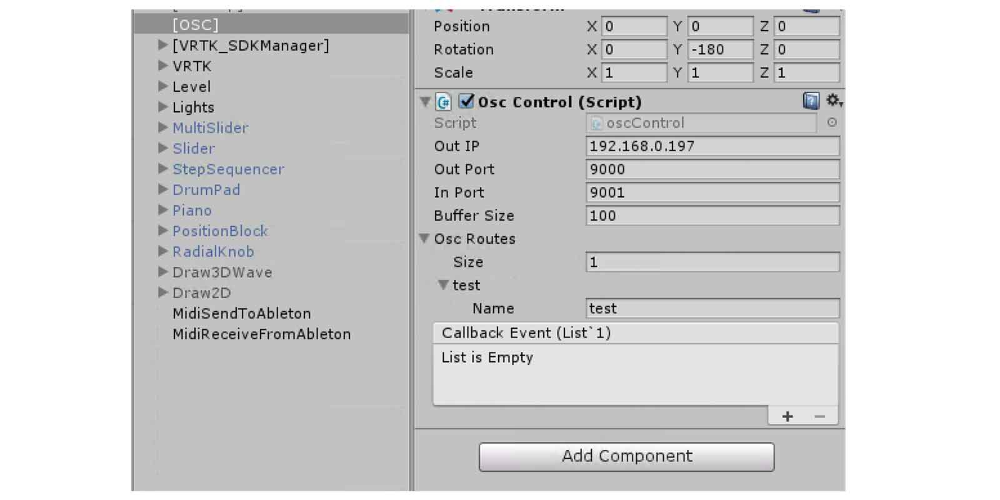

### Midi Receive Events
**Unity Attach**: GameObject \
Receive named midi events in Ableton from Unity collisions. The Midi Send Events script  sends when the GameObject `OnCollisionEnter` event is triggered.
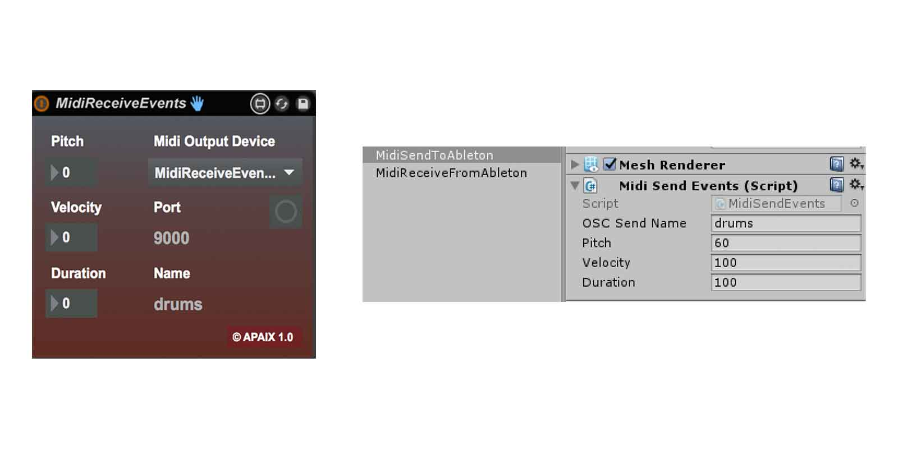

### Midi Send Events
**Unity Attach**: GameObject or empty GameObject \
Send named midi events to Unity from Ableton. Attach any `public` function to the Note on / off events in the inspector.
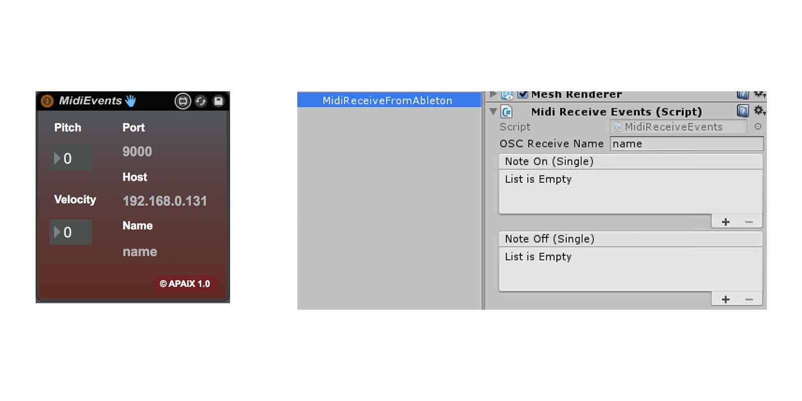

### VRControllerPosition
**Unity Attach**: VRTK_Controller \
VRTK controller positions to XYZ `live.dial`s. Map the controller positions to any value.
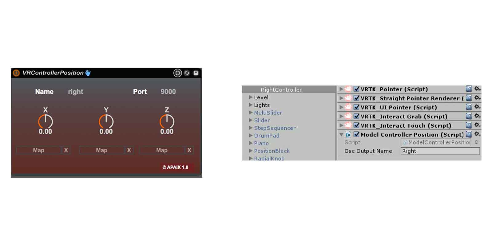

### VRPosition
**Unity Attach**: GameObject with Transform \
Attach to Unity GameObject and send its transform to XYZ `live.dial`s. Useful for panning Envelop for Live sources.
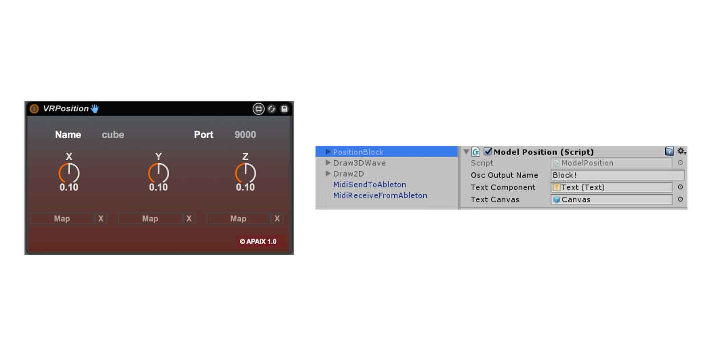

### VRDial
**Unity Attach**: GameObject with UI Canvas child \
Radial UI controller to `live.dial`. This component does not take a name but could be easily modified to do so based on other patterns in these tools.
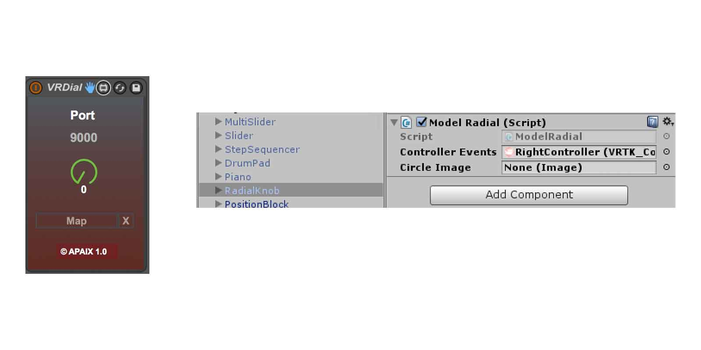

### VR2DWave
**Unity Attach**: GameObject \
Draw on 2D material to `waveform~`. 
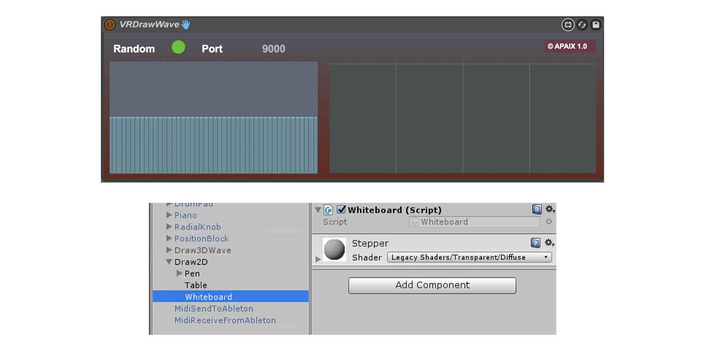

### VR3DWave
**Unity Attach**: empty GameObject \
New instrument example with a wave picker, controller position and velocity to custom M4L device. 
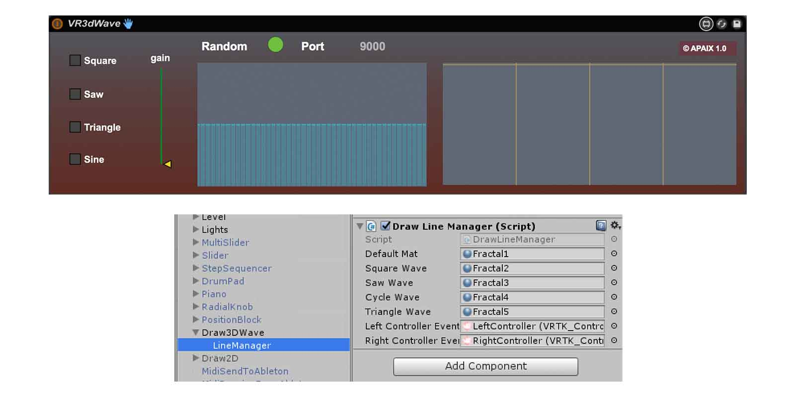

### VRDrumPads
**Unity Attach**: GameObject(s) \
Physics reactive cubes to Ableton drum rack.
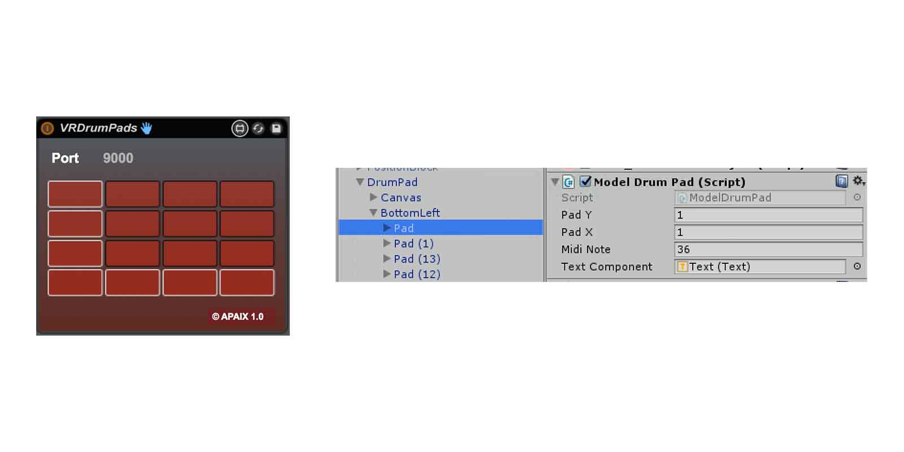

### VRMultiSlider
**Unity Attach**: GameObject(s) \
Interactive cube height transforms to `multislider`. Grab or select cubes with laser pointer. Can select multiple. Scale by amount is mutliplied by the height value. Example of scaling values for other object interpretations.
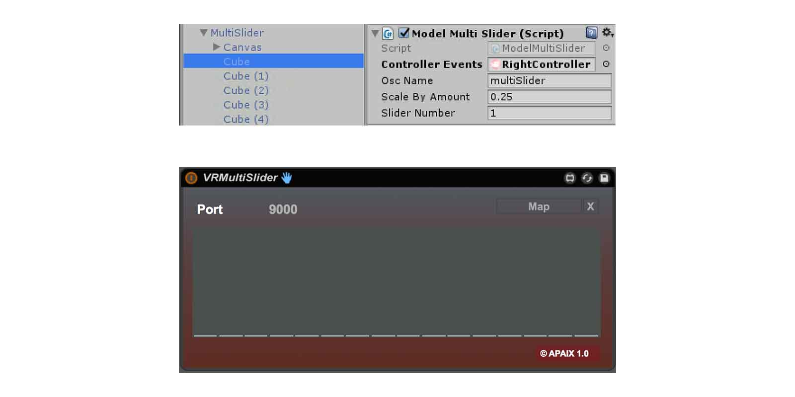

### VRSlider
**Unity Attach**: GameObject with UI Canvas child \
UI slider to to `live.slider`.
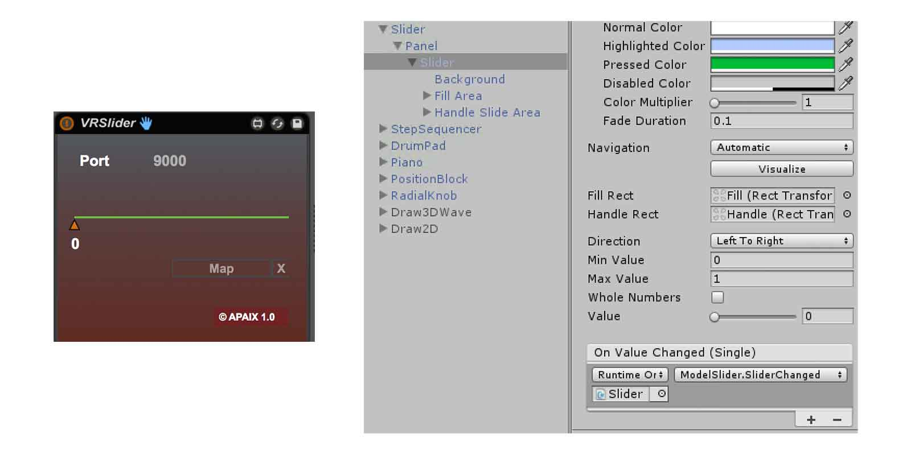

### VRMidiKeyboard
**Unity Attach**: GameObject \
Virtual piano model sends midi duration and pitch. Represented by `kslider`.
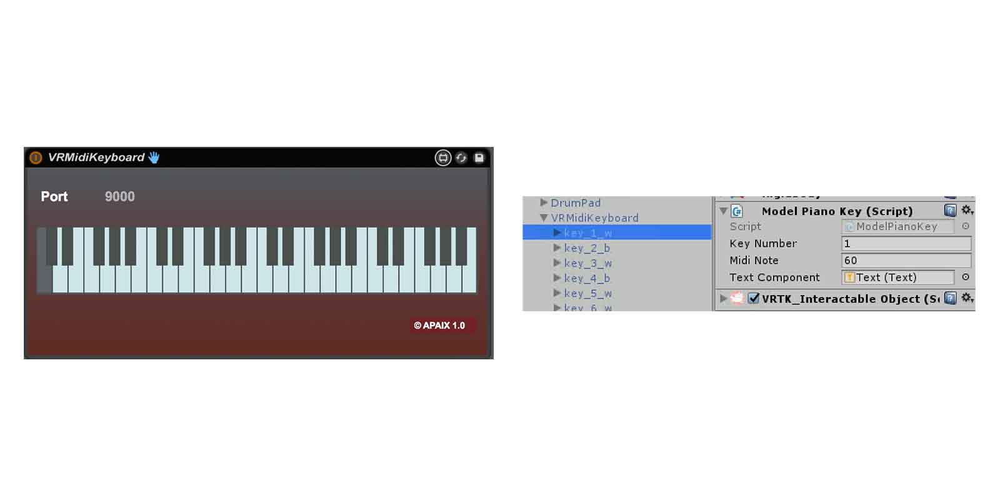

### VRStepper
**Unity Attach**: GameObject \
Cube represenation of a stepper to `live.step`. Laser pointer controls on / off and touchpad controls velocity.
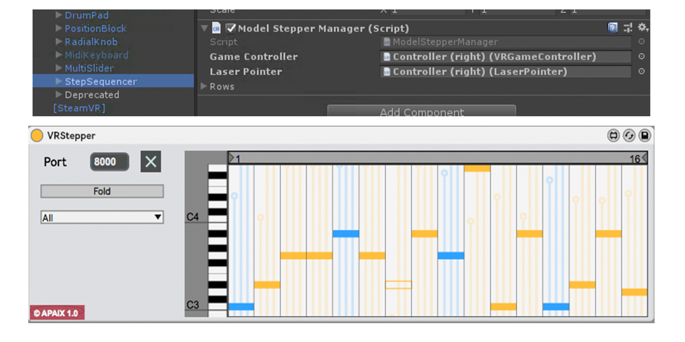

### Envelop
**Unity Attach**: empty GameObject \
[Envelop for Live](https://github.com/EnvelopSound/EnvelopForLive) is an open source audio production framework for spatial audio composition and performance. This component contains a spatial audio representation of the decoder for the their speaker installations. You can send positional values and audio levels from Max to Unity for 3d representations. 

#### Credits
Many thanks to the work of others whose shoulders I stand on to build musical interfaces.

- [OSC package](https://github.com/jorgegarcia/UnityOSC) by Jorge Garcia
- [CNMAT](http://cnmat.berkeley.edu/) for their research in music technology and providing [o.dot](https://github.com/CNMAT/CNMAT-odot).
- The Envelop team for all the inspiration and help.
- Icons for VR3DWave from the Noun project.
- The band Caspian for the project name. A tribute to their first album.
